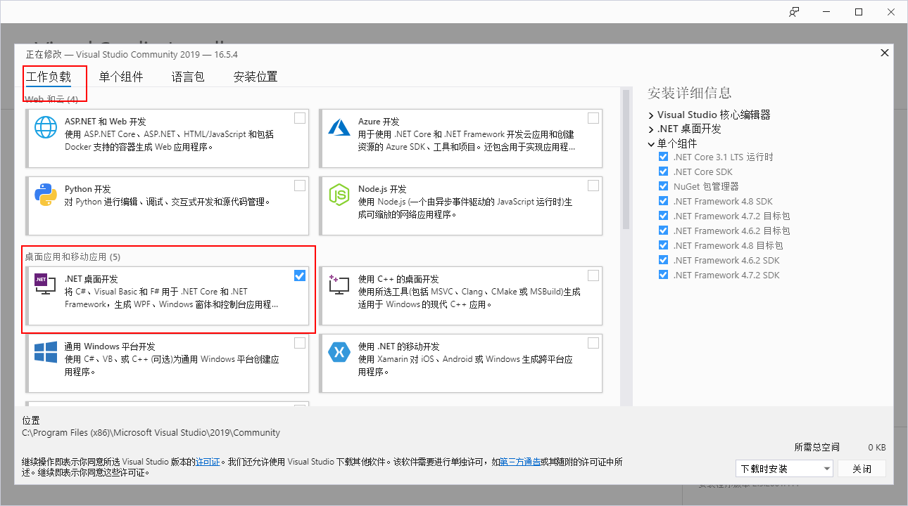
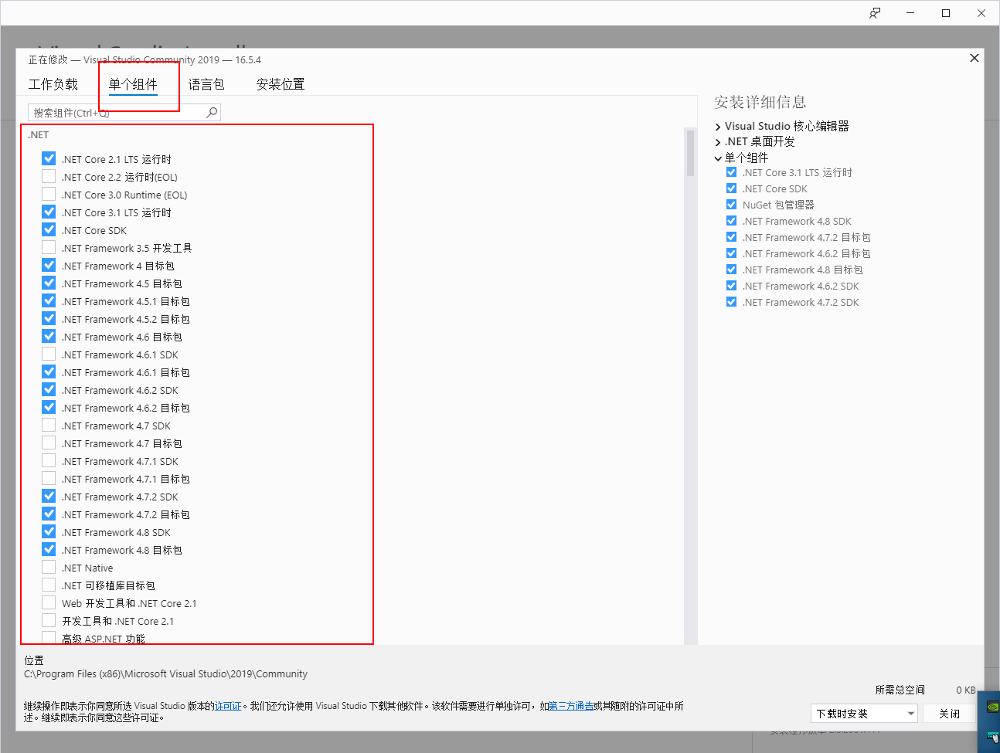
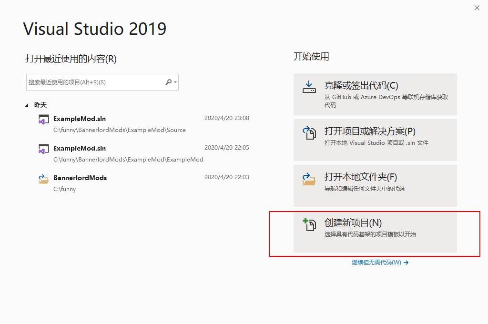
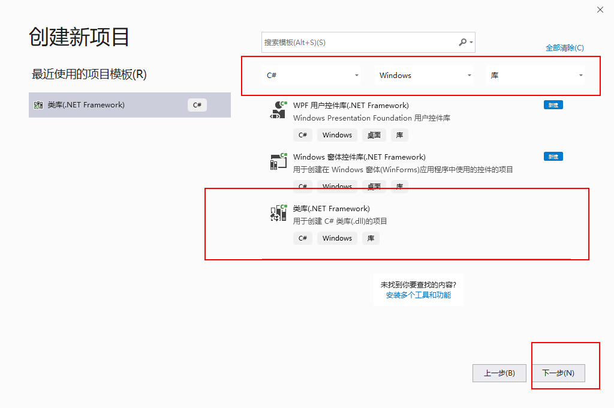
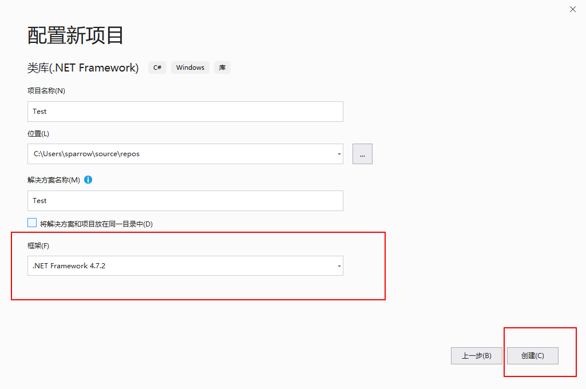
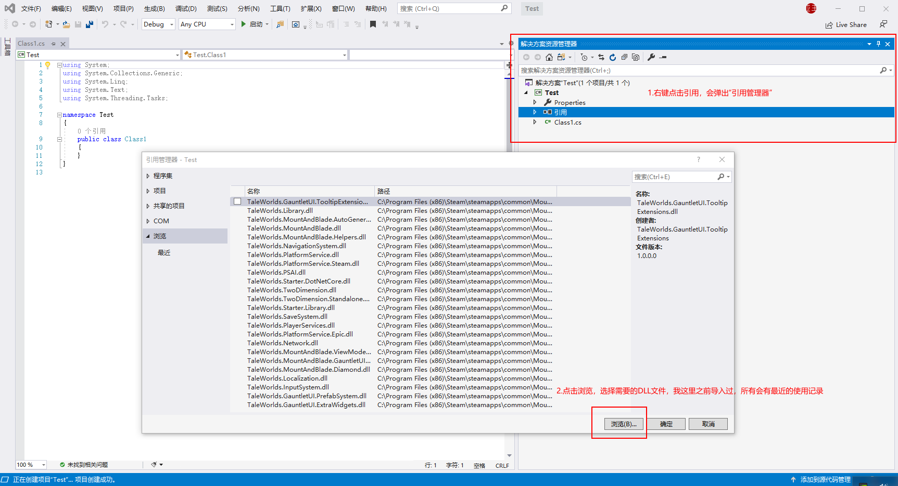
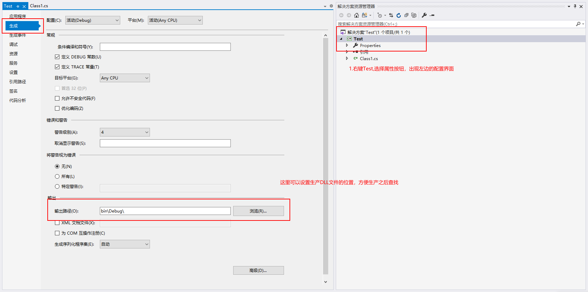
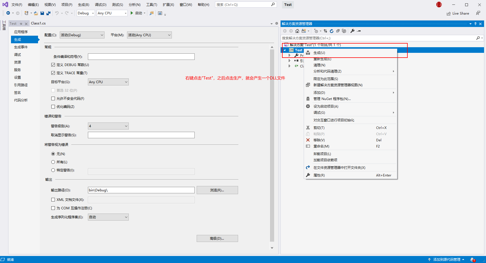
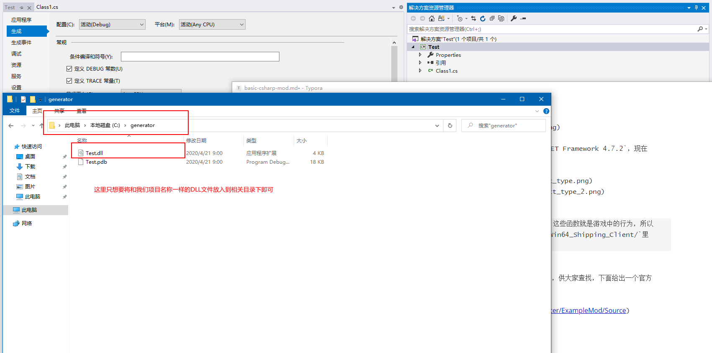

# 基础 C\# Mod

## 简介

接下来会一步一步引导制作出一个基础的 C\# mod。 这个`Mod`将在单人游戏标题屏幕上添加一个名为“Messa ge”的按钮。单击后，此按钮将输出“Hello World”。 

## 准备

#### 针对这个教程我们将将要制作的`Mod`命名为 `ExampleMod`.

### 设置Module \(SubModule.xml\)

1. 进入到游戏的 `Modules` 文件夹

2. 创建一个文件夹并且命名为 `ExampleMod` (一定要和`SubModule.xml`中的`Id`保持一致)

3. 在Mod文件夹下创建`/bin/Win64_Shipping_Client`文件夹

4. 在Mod文件夹下创建一个 `SubModule.xml` 文件 (必须是这个名字) 

   ```xml
    <Module>
        <Name value="Example Mod"/>
        <Id value="ExampleMod"/>
        <Version value="v1.0.0"/>
        <SingleplayerModule value="true"/>
        <MultiplayerModule value="false"/>
        <DependedModules>
            <DependedModule Id="Native"/>
            <DependedModule Id="SandBoxCore"/>
            <DependedModule Id="Sandbox"/>
            <DependedModule Id="CustomBattle"/>
            <DependedModule Id="StoryMode" />
        </DependedModules>
        <SubModules>
            <SubModule>
                <Name value="ExampleMod"/>
                <DLLName value="ExampleMod.dll"/>
                <!-- MySubModule 是将要在教程编程章节创建的类名称 -->
                <SubModuleClassType value="ExampleMod.MySubModule"/>
                <Tags>
                    <Tag key="DedicatedServerType" value="none" />
                    <Tag key="IsNoRenderModeElement" value="false" />
                </Tags>
            </SubModule>
        </SubModules>
        <Xmls/>
    </Module>
   ```

5. 如果您使用其他名称，请更改上述值以匹配您的Module / SubModule的值。

6. 启动启动器，并确保您的mod出现 `Singleplayer` &gt; `Mods`中。

[有关Mod结构的更多信息](../_intro/folder-structure.md).

### 搭建开发环境
1. 下载[Visual Studio 2019社区版](https://visualstudio.microsoft.com/zh-hans/downloads/)
2. 点击安装，安装过程中需要选择我们开发需要的组件，不要使用默认的，默认的有`20多G`。选择如图中的工作负载和单个组件。

   
   

注：单个组件别动其它默认加载的组件，只需要勾选我们需要的`.NET`相关的开发包就可以了。其中有些是不需要安装的，这里没有尝试最小化安装。安装下来也就5G左右吧。

3. 创建新工程
> 等待安装完毕，打开IDE（刚才打开的是安装器，如果之后需要修改安装的包，可以去里面添加/修改），创建一个.NET库的新工程


4. 选择创建一个.NET Framework的工程，官方推荐使用`.NET Framework 4.7.2`，现在IDE默认就是使用`.NET Framework 4.7.2`

   
   

5. 引入骑砍相关依赖包
> 我们开发其实就是调用一些官方/个人提供的一些函数/方法，这些函数就是游戏中的行为，所以我们要在项目中引入官方的`*.DLL`文件。在`游戏目录/bin/Win64_Shipping_Client/`里面。
   
6. 编写相关代码
> 此处略过，之后会一直翻译这个中文文档，会放在一个网站上，供大家查找，下面给出一个官方的教程的示例。
[官方教程实现源码](https://gitee.com/wang_ya_nan/BannerlordMods/tree/master/ExampleMod/Source)

7. 导出文件
   
   

8. 将生产的文件放到我们自己Mod文件夹下创建的`/bin/Win64_Shipping_Client`文件夹中
   

[如何设置生产路径](https://docs.microsoft.com/en-us/visualstudio/ide/how-to-change-the-build-output-directory?view=vs-2019)
[如何添加引用](https://docs.microsoft.com/en-us/visualstudio/ide/how-to-add-or-remove-references-by-using-the-reference-manager?view=vs-2019)

###  调试项目 (Optional)

#### 方法一(Rider IDE)
1. Open your project properties and go to the `Debug` tab.
2. Select the `Start external program` option and then browse for `Bannerlord.exe` located in the `bin\Win64_Shipping_Client` directory in your game files \(not your module directory\).
3. Set your working directory to the `bin\Win64_Shipping_Client` directory in your game files \(not your module directory\).
4. Add the following command line arguments \(be sure to replace ExampleMod with the name of your module\):
   * `/singleplayer _MODULES_*Native*SandBoxCore*CustomBattle*SandBox*StoryMode*ExampleMod*_MODULES_`

#### Way 2 (If you want to start your debugging from launcher window)
1. Open your project properties and go to the `Debug` tab.
2. Select the `Start external program` option and then browse for `TaleWorlds.MountAndBlade.Launcher.exe` located in the `bin\Win64_Shipping_Client` directory in your game files \(not your module directory\).
3. Set your working directory to the `bin\Win64_Shipping_Client` directory in your game files \(not your module directory\).

