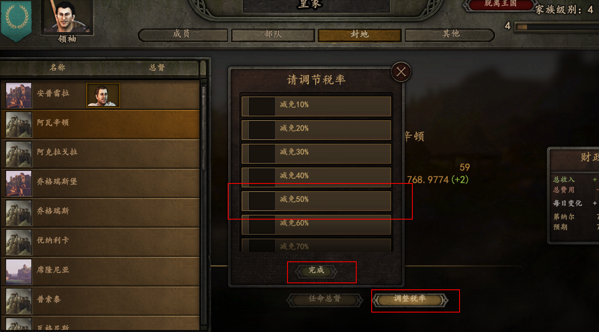

## [原创]\[村庄税率调节\][2020-05-03]\[v2.0.0\]

> 支持玩家手动为自己的村庄减免赋税，从而增加户数

## 操作说明

## 户数增加逻辑

1. 减免赋税的影响

| 减免比例 | 户数增加倍数(RateInfluenceCoefficient) |
| -------- | -------------------------------------- |
| 100%     | 2.0                                    |
| 90%      | 1.9                                    |
| 80%      | 1.8                                    |
| 70%      | 1.7                                    |
| 60%      | 1.6                                    |
| 50%      | 1.5                                    |
| 40%      | 1.2                                    |
| 30%      | 0.9                                    |
| 20%      | 0.6                                    |
| 10%      | 0.3                                    |

2. 村庄原有户数影响赋税带来的倍数 

| 原有户数 | 影响因子(healthInfluenceCoefficient) |
| -------- | ------------------------------------ |
| <200     | 2.0                                  |
| <400     | 1.5                                  |
| <600     | 0.9                                  |
| <800     | 0.8                                  |
| <1000    | 0.6                                  |
| >1000    | 0                                    |

### 计算公式

基础增长值 * （1 + （RateInfluenceCoefficient * healthInfluenceCoefficient ）)

### 说明

1. 当前户数越少，效果越明显
2. 户数超过1000时，减免赋税不再对户数的增加造成影响
3. 基础增长值为**负数**的时候，减免赋税不对户数造成影响
4. 尚未加入AI的支持，AI默认不会调节税率
5. 尚未处理玩家丢失村庄的情况，既村庄丢失后仍然使用最后一次设置的税率（难道这不是一条捷径吗？）

## 注意

**可能会和其它MOD冲突，如果发生冲突，之后会持续优化，尽量减少冲突**

## 之后会处理的问题

1. 处理村庄丢失的情况
2. AI相关设置
3. 玩家自定义税率的影响
4. 尝试考虑人口迁移的问题（一个村庄税率较低，相邻村庄的住户会不会搬家。。。）

## MOD下载地址

[VillageRateMOD](https://gitee.com/wang_ya_nan/Bannerlord/releases/)

## MOD源码地址

[Gitee地址](https://gitee.com/wang_ya_nan/BannerlordMods/tree/master/VillageTaxRateMod/Source/VillageTaxRateMod)

